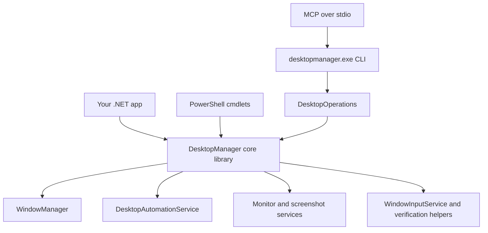
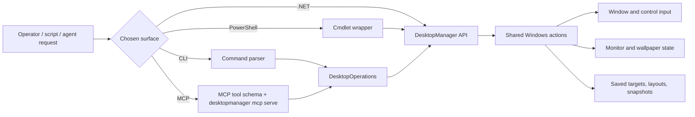
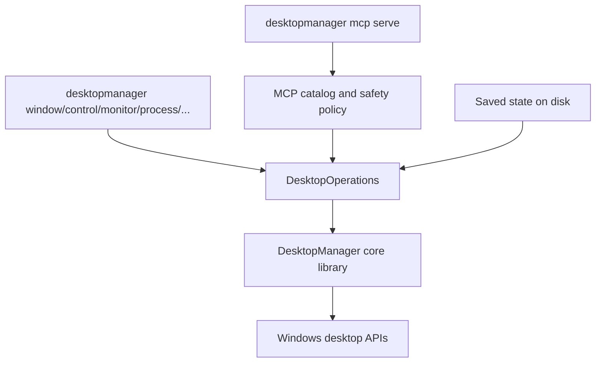
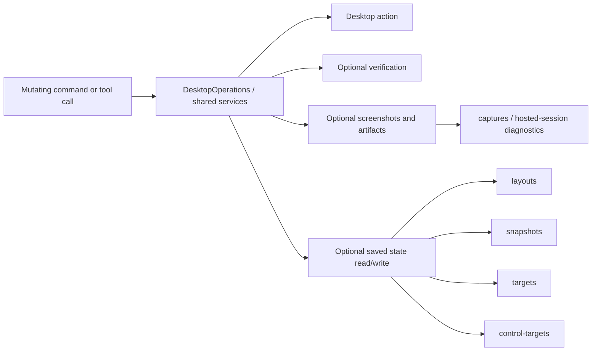
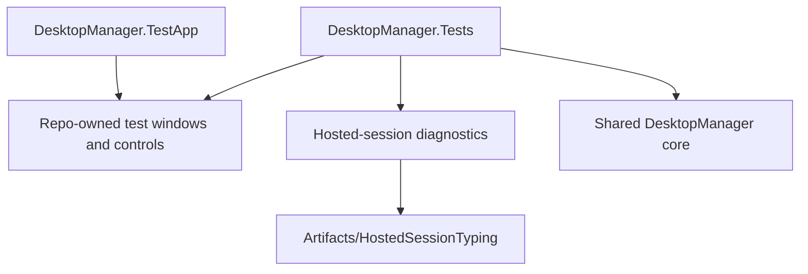

# DesktopManager Architecture

DesktopManager exposes one shared desktop-automation core through several different surfaces. This document shows how the C# library, PowerShell module, CLI executable, and MCP server relate to each other, where state is stored, and how request and verification flows are shared.

## Surface Overview

| Surface | Audience | Strengths | Typical entrypoint |
| ------- | -------- | --------- | ------------------ |
| C# library | App developers | Direct API access, strongest typing, reusable inside your own code | `DesktopManager.dll` |
| PowerShell module | Operators and scripters | Cmdlet UX, object pipeline, easy admin automation | `Install-Module DesktopManager` |
| CLI | Humans, shell scripts, JSON-oriented tooling | Simple commands, process isolation, direct manual use, MCP host entrypoint | `desktopmanager.exe` |
| MCP server | Agents and desktop copilots | Inspect-first safety model, process scoping, dry-run and mutation controls | `desktopmanager mcp serve` |


```

## What Runs Where

The important design choice is that DesktopManager tries hard to keep desktop behavior in the shared C# library instead of re-implementing it in each surface.

- The **C# library** owns the real desktop behavior.
- The **PowerShell module** wraps that behavior in cmdlets and PowerShell-friendly records.
- The **CLI** wraps it in command parsing, JSON/text formatting, and desktop-oriented workflows.
- The **MCP server** is hosted by the CLI executable and reuses the same `DesktopOperations` layer as normal CLI commands.



## CLI and MCP Relationship

The MCP server is not a separate desktop engine. It is a hosted mode of `desktopmanager.exe` that exposes the same operation layer over stdio.



That means:

- CLI and MCP share result shaping, saved-state conventions, and mutation behavior.
- MCP safety flags such as `--allow-mutations`, `--allow-process`, and `--dry-run` are layered around the same underlying operations.
- Fixes in the shared library usually benefit CLI, MCP, and PowerShell together.

## Manual Use vs Agent Use

| Scenario | Best surface | Why |
| -------- | ------------ | --- |
| Embed DesktopManager in your own product | C# library | You want direct APIs and full control in-process |
| Run a repeatable operator script | PowerShell module | Native PowerShell objects and cmdlet ergonomics |
| Run one-off commands manually or from CI | CLI | Simple command syntax and optional JSON output |
| Let an agent inspect and then mutate cautiously | MCP | Read-only by default with explicit mutation controls |

For manual work, the CLI is the most direct path:

```text
desktopmanager window list
desktopmanager window geometry --process notepad --json
desktopmanager control diagnose --window-title "Codex" --json
desktopmanager process start-and-wait notepad.exe --window-title "*Notepad*" --json
desktopmanager mcp serve --allow-mutations
```

For repeatable operator automation, the PowerShell module is usually the best fit:

```powershell
Get-DesktopWindow
Get-DesktopWindowControl -Name "*Notepad*"
Set-DesktopWindow -Name "*Notepad*" -Left 0 -Top 0 -Width 1200 -Height 900
Set-DesktopWindowText -Name "*Notepad*" -Text "Hello world"
```

## Shared State and Artifacts

DesktopManager uses the same core storage concepts across surfaces.

| Kind | Purpose | Typical location |
| ---- | ------- | ---------------- |
| Layouts | Saved window arrangements | `%AppData%\DesktopManager\layouts` |
| Snapshots | Saved desktop/window state | `%AppData%\DesktopManager\snapshots` |
| Targets | Reusable window-relative click/drag/screenshot areas | `%AppData%\DesktopManager\targets` |
| Control targets | Reusable control selectors | `%AppData%\DesktopManager\control-targets` |
| Captures | Screenshots and evidence | `%AppData%\DesktopManager\captures` or caller-provided artifact directory |
| Hosted-session diagnostics | Focus-steal and retry diagnostics from test harnesses | `Artifacts\HostedSessionTyping` in the repo |



## Verification and Feedback Flow

DesktopManager is moving away from a bare "request succeeded" model and toward optional post-action verification.

- CLI mutating commands can opt into `--verify`.
- MCP mutating tools can request verification in structured results.
- PowerShell cmdlets can opt into `-Verify` and `-PassThru`.

That verification is shared wherever possible:

- geometry-sensitive actions can verify observed position and size
- focus-sensitive actions can verify the foreground window
- minimize-style actions can verify state
- higher-risk typing or pointer actions can still return honest presence-oriented observation, even when perfect proof is not available

## Safety Model

DesktopManager now uses a more explicit safety split for tests and agent/operator sessions.

| Area | Safety idea |
| ---- | ----------- |
| MCP | Read-only by default, mutations require `--allow-mutations` |
| Risky control fallback | Explicit `--allow-foreground-input` |
| Hosted-session typing | Explicit foreground/scancode modes with abort-on-focus-drift behavior |
| Tests | Separate gates for owned-window UI, destructive owned-window mutation, foreground focus, system-wide changes, external apps, and experiments |
| Mutation feedback | CLI, MCP, and PowerShell can opt into richer verification instead of trusting a bare success path |

## Test and Harness Relationship

The repo also includes a local desktop harness app so DesktopManager can validate tricky UI flows without defaulting to live third-party apps.


```

This is why current UI tests are safer than earlier generations of the suite:

- many tests now touch repo-owned WinForms/WPF harness windows instead of your live apps
- foreground-stealing and system-wide tests are separately gated
- hosted-session experiments leave structured diagnostics instead of silently failing

## Where to Read Next

- [Docs/DesktopManager.Cli.md](DesktopManager.Cli.md)
- [Docs/DesktopManager.Mcp.md](DesktopManager.Mcp.md)
- [Docs/Build.Runbook.md](Build.Runbook.md)
